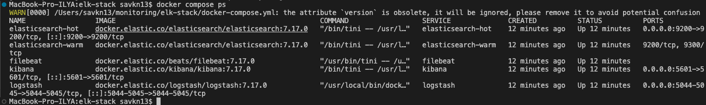
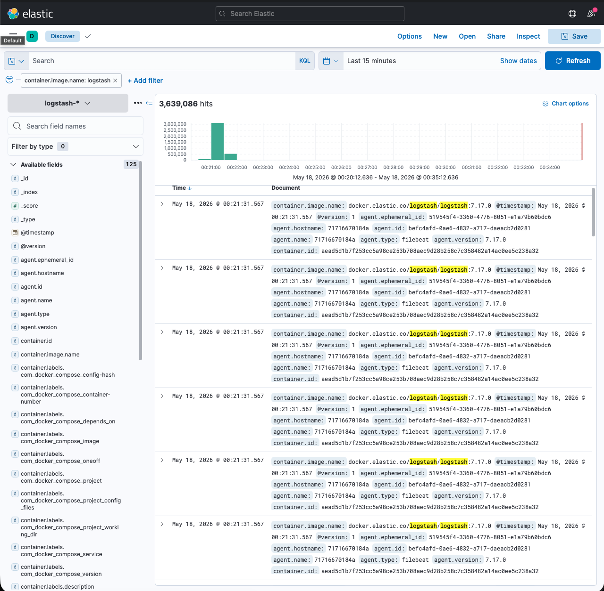

# Домашнее задание к занятию 15 «Система сбора логов Elastic Stack» Савкин ИН

---

## Задание 1. Запуск ELK-стека

Стек развёрнут самостоятельно без использования директории `help`.

### Конфигурация docker-compose.yml

```yaml
version: '3'
services:
  elasticsearch-hot:
    image: docker.elastic.co/elasticsearch/elasticsearch:7.17.0
    container_name: elasticsearch-hot
    environment:
      - node.name=elasticsearch-hot
      - cluster.name=docker-cluster
      - discovery.seed_hosts=elasticsearch-warm
      - cluster.initial_master_nodes=elasticsearch-hot
      - bootstrap.memory_lock=true
      - xpack.security.enabled=false
      - "ES_JAVA_OPTS=-Xms512m -Xmx512m"
      - node.attr.box_type=hot
    ulimits:
      memlock:
        soft: -1
        hard: -1
    volumes:
      - es-hot-data:/usr/share/elasticsearch/data
    ports:
      - "9200:9200"
    restart: unless-stopped

  elasticsearch-warm:
    image: docker.elastic.co/elasticsearch/elasticsearch:7.17.0
    container_name: elasticsearch-warm
    environment:
      - node.name=elasticsearch-warm
      - cluster.name=docker-cluster
      - discovery.seed_hosts=elasticsearch-hot
      - cluster.initial_master_nodes=elasticsearch-hot
      - bootstrap.memory_lock=true
      - xpack.security.enabled=false
      - "ES_JAVA_OPTS=-Xms512m -Xmx512m"
      - node.attr.box_type=warm
    ulimits:
      memlock:
        soft: -1
        hard: -1
    volumes:
      - es-warm-data:/usr/share/elasticsearch/data
    restart: unless-stopped

  logstash:
    image: docker.elastic.co/logstash/logstash:7.17.0
    container_name: logstash
    environment:
      - "LS_JAVA_OPTS=-Xms512m -Xmx512m"
    volumes:
      - ./logstash/pipeline/logstash.conf:/usr/share/logstash/pipeline/logstash.conf
    ports:
      - "5044:5044"
      - "5045:5045"
    depends_on:
      - elasticsearch-hot
    restart: unless-stopped

  kibana:
    image: docker.elastic.co/kibana/kibana:7.17.0
    container_name: kibana
    ports:
      - "5601:5601"
    environment:
      - ELASTICSEARCH_HOSTS=http://elasticsearch-hot:9200
    depends_on:
      - elasticsearch-hot
    restart: unless-stopped

  filebeat:
    image: docker.elastic.co/beats/filebeat:7.17.0
    container_name: filebeat
    user: root
    volumes:
      - ./filebeat/filebeat.yml:/usr/share/filebeat/filebeat.yml:ro
      - /var/lib/docker/containers:/var/lib/docker/containers:ro
      - /var/run/docker.sock:/var/run/docker.sock:ro
    depends_on:
      - logstash
    restart: unless-stopped

volumes:
  es-hot-data:
  es-warm-data:
```

### Конфигурация Logstash (logstash/pipeline/logstash.conf)

```ruby
input {
  tcp {
    port => 5044
    codec => json
  }
  beats {
    port => 5045
  }
}

filter {
  if [message] {
    mutate {
      add_field => { "received_at" => "%{@timestamp}" }
    }
  }
}

output {
  elasticsearch {
    hosts => ["http://elasticsearch-hot:9200"]
    index => "logstash-%{+YYYY.MM.dd}"
  }
  stdout {
    codec => rubydebug
  }
}
```

### Конфигурация Filebeat (filebeat/filebeat.yml)

```yaml
filebeat.inputs:
  - type: container
    paths:
      - '/var/lib/docker/containers/*/*.log'

processors:
  - add_docker_metadata:
      host: "unix:///var/run/docker.sock"
  - decode_json_fields:
      fields: ["message"]
      target: "json"
      overwrite_keys: true

output.logstash:
  hosts: ["logstash:5045"]

logging.level: info
```

### Примечание по развёртыванию на Apple Silicon (M1/M2/M3)

При развёртывании на macOS с Apple Silicon возникла проблема совместимости образов Logstash 8.x:
- Образы `logstash:8.x` из Docker Hub и официального реестра Elastic не имеют нативной ARM64 сборки
- Решение: использовать версию **7.17.0**, которая корректно работает через эмуляцию Rosetta 2
- Также потребовалась очистка volumes при даунгрейде с 8.x на 7.x (`docker compose down -v`)

### Скриншот docker compose ps (5 контейнеров)



### Скриншот веб-интерфейса Kibana


---

## Задание 2. Index Patterns и просмотр логов в Kibana

Создан index pattern `logstash-*` с временным полем `@timestamp`.

В интерфейсе Discover:
- Выбран index pattern `logstash-*`
- Доступно **125 полей** включая `container.image.name`, `container.id`, `agent.type`, `@timestamp`
- Filebeat собирает логи всех Docker-контейнеров и передаёт через Logstash в Elasticsearch
- Индекс `logstash-2026.05.17` содержит более **2.5 млн записей**

Пример фильтрации логов по контейнеру:
```
container.image.name: logstash
```

Скриншот Kibana Discover с логами:


